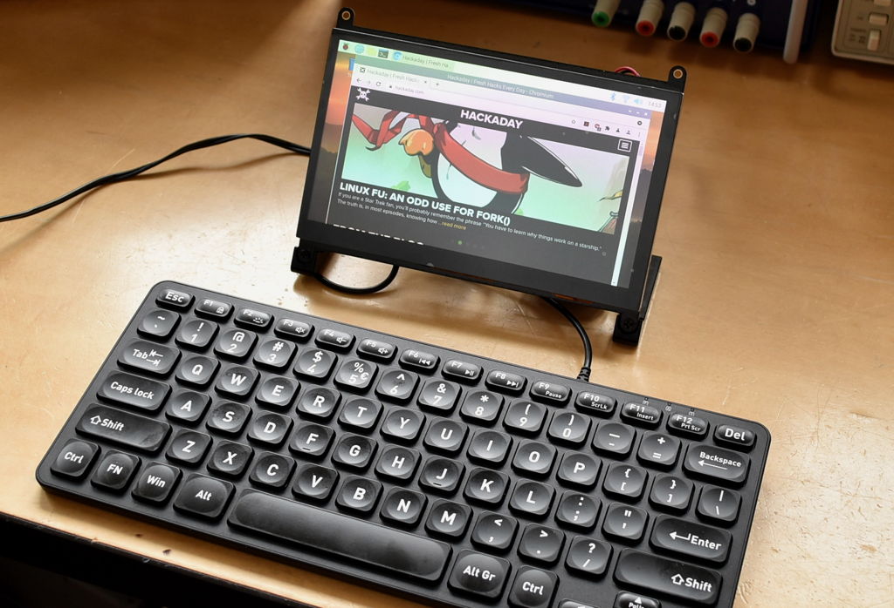
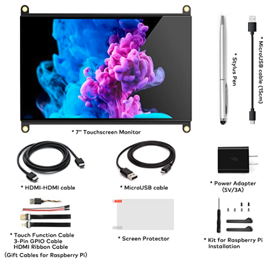
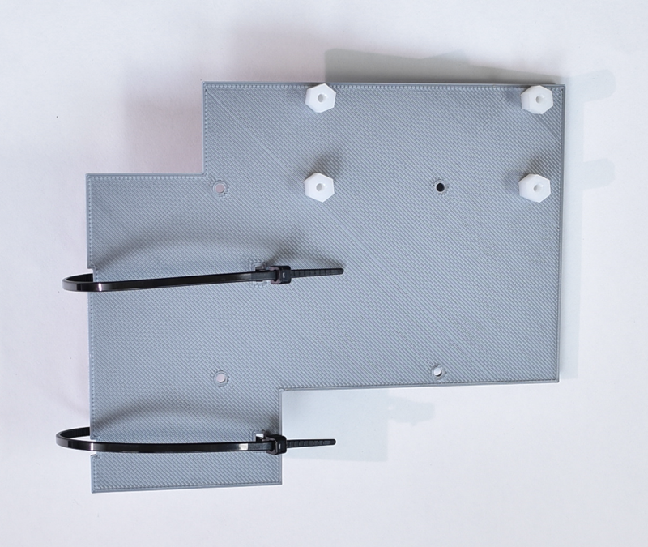
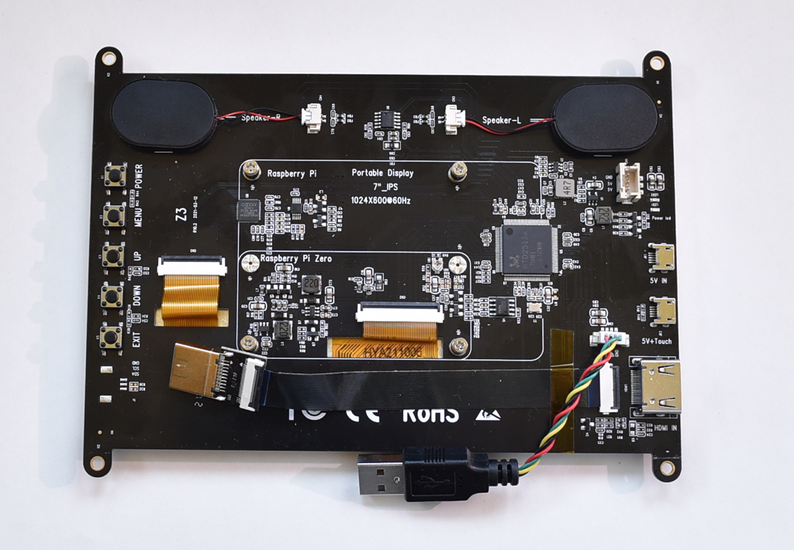
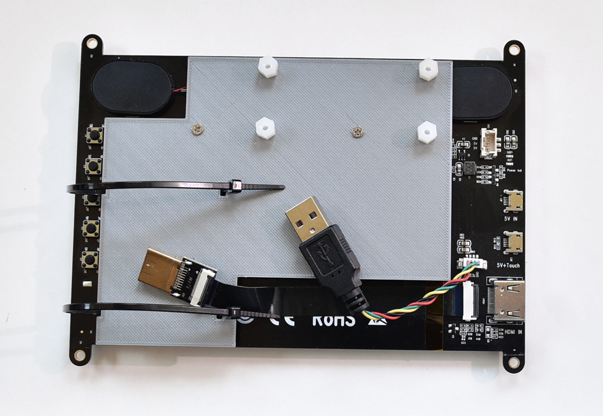
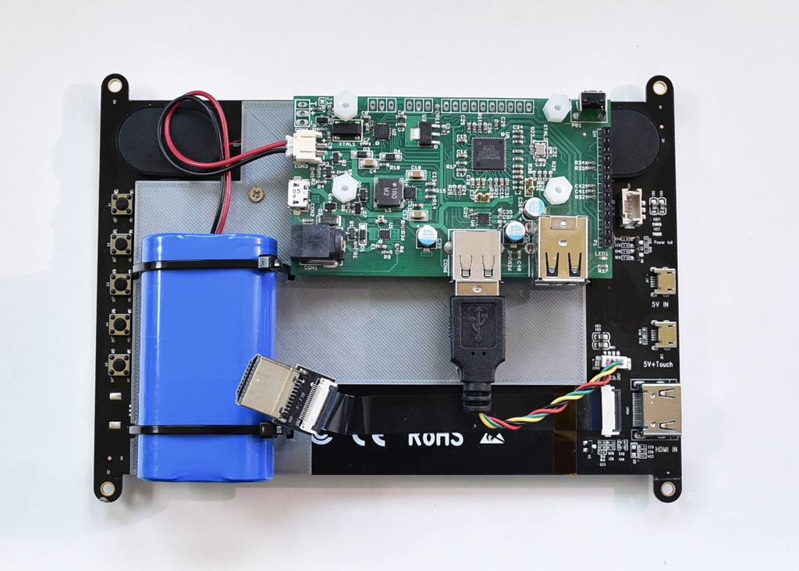
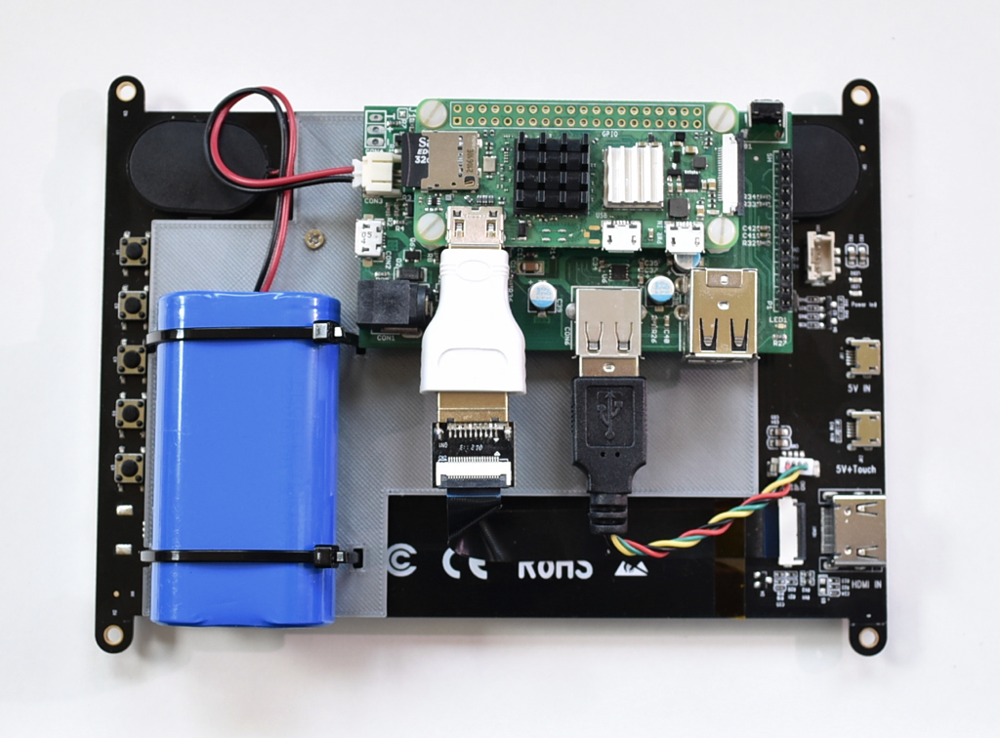
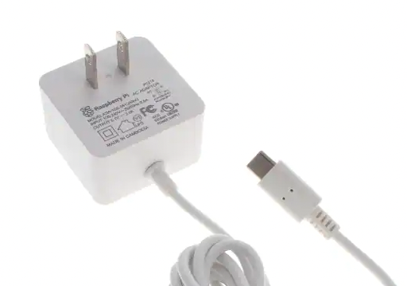

## Porta-Pi
This directory contains the design for a 3D-printed baseplate and instructions for assembling a portable touchscreen based computer using the Raspberry Pi Zero 2 W that has higher resolution than the official 7" Pi LCD screen.  The Solar Pi Platter is used to provide power management, including soft power control, charging and switched USB expansion ports.  Features include

- 7" 1024x600 pixel capacitive touch LCD screen
- Stereo sound with built in speakers
- USB powered with 4400 mAHr battery for portable use
- Two power-switched USB ports
- Auto power-off after software shutdown using ```ppd``` utility.



### Parts

1. Solar Pi Platter ([tindie link] (https://www.tindie.com/products/globoy/solar-pi-platter/))
2. Raspberry Pi Zero 2 W
3. Norsmic 7" HDMI monitor ([Amazon link](https://www.amazon.com/gp/product/B09KB7XKB2))
4. 4400 mA 3.7V Li-Ion battery ([Adafruit link](https://www.adafruit.com/product/354)).  Be sure to use a battery with the Adafruit/Sparkfun style polarity 2mm JST connector.
5. Full-size to mini HDMI adapter (get the smallest adapter - not cable - you can find).
6. 4 4-40 3/8" nylon stand-offs (the same stand-offs that come with the Solar Pi Platter).
7. 2 165x2.5mm (6.5x0.1") zip ties.
8. 3D printed base plate (using STL files found here).

In case the Amazon link no longer works, look for a monitor like the following.  You will use the short USB cable and flex circuit HDMI cable.  The included Power Adapter and MicroUSB cable can be used to power the Porta-Pi.



### Assembly
#### Base Plate
Slice and 3D print the ```mount_plate.stl``` file from the ```baseplate``` directory here.

Install the four extra stand-offs using the nuts from the Solar Pi Platter and the two zip ties (don't close them fully yet).



#### Add USB and HDMI cables to LCD module
The Norsmic LCD screen comes with several cables including a short USB cable and a short flat HDMI cable.  Connect those to the monitor as shown below.  I used some tape to ensure the flat cable was secure.



#### Mount Base Plate
Attach the assembled Base Plate to the Raspberry Pi standoffs on the back of the monitor using the four metal screws that came with it.



#### Mount the Pi Platter and Battery
Attach the Pi Platter to the Base Plate using the four stand-offs that came with it.   Plug the USB cable into the single (un-switched Pi Platter USB port).  Also mount the battery to the Base Plate as shown below and tighten the zip ties to hold it in place.  Cut off the extra zip tie material.



#### Mount the Raspberry Pi Zero 2 W

Attach the Pi Zero to the Pi Platter using the four nylon screws that came with the Pi Platter.  Plug the HDMI cable into the Pi's mini-HDMI port using the HDMI to Mini HDMI adapter plug.



Congratulations, the hardware is assembled.  You can use the mounted provided in the monitor kit or you can assembled the completed unit into your own enclosure using the screw mounts on the top and bottom of the monitor PCB.

#### Note about power
The ideal power source for this system is a 2.5A 5.1V Micro-USB power supply such as the official Raspberry Pi supply.  The slightly higher supply voltage allows the Pi Platter to both power the system and charge the battery with its maximum 750 mA charge rate.



The adapter supplied by Norsmic or other adapters with > 2.5A can also be used.

WARNING: Only plug the USB cable into the Pi Platter Micro-USB port.  Do not connect anything to either Pi Micro-USB ports.  Doing so may damage the Pi Platter.

You can even use the solar panel input on the Pi Platter to charge the system from sunlight.  However that input won't be able to keep both the battery charged and system powered so it would be most useful in a situation where you charge the system using solar power and then run it for a while from the battery.

### Software Setup
#### Load Raspbian
Load a 32-bit Raspbian distribution onto a Micro-SD card and install it in the Raspberry Pi.  Power the Pi Platter with the USB adapter.  Turn the system on by pressing the Pi Platter power button.  You will see the green light turn on the Pi Platter followed by the Raspberry Pi booting.

#### Load and configure the Pi Platter utilities
Install the ```ppd``` utility program (found in this repository or from my website), for example in ```/usr/local/bin```.  Add the following line  to the ```/etc/rc.local``` file.

	/usr/local/bin/ppd -p 23000 -o 30 -r -d &

This will configure the utility as a daemon that watches for the SIGTERM signal and uses that to power off the system 30 seconds later.  This signal is sent when you select shutdown from the GUI or execute ```shutdown now``` from the command line.

You may also install ```ppp_power_mon``` to add a desktop widget displaying the current battery level and charge status, as well as providing controls to switch on and off the other two USB ports on the Pi Platter.

### Operation
Switch the system on by pressing the power button on the Pi Platter.

Switch the system off by selecting ```Logoff->Shutdown``` from the Start Menu or typing ```sudo shutdown now``` in a terminal.

The monitor should automatically power on when the Pi video starts.  You use the buttons on the monitor PCB to control brightness and volume.

### Questions?

Contact the author - dan@danjuliodesigns.com