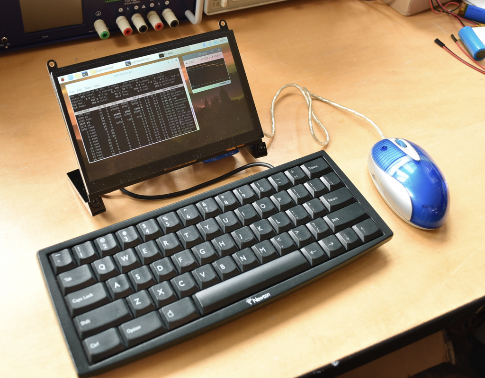
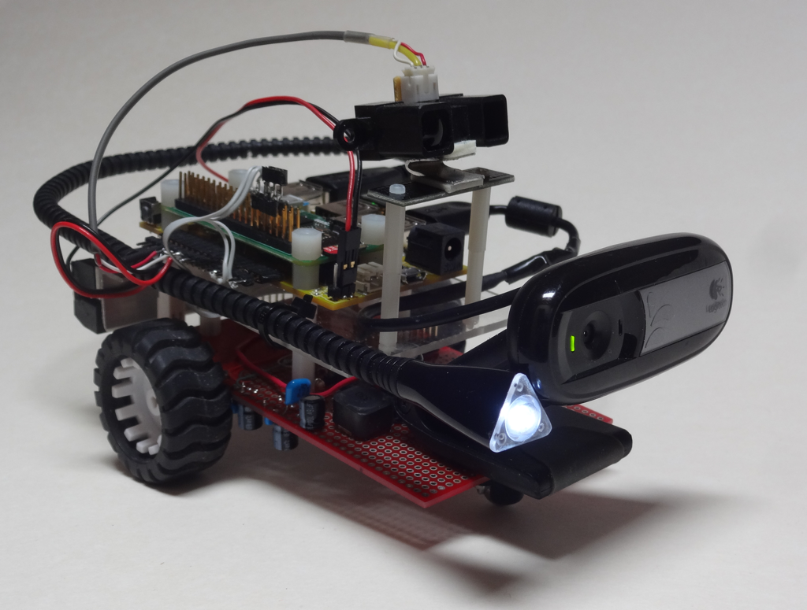
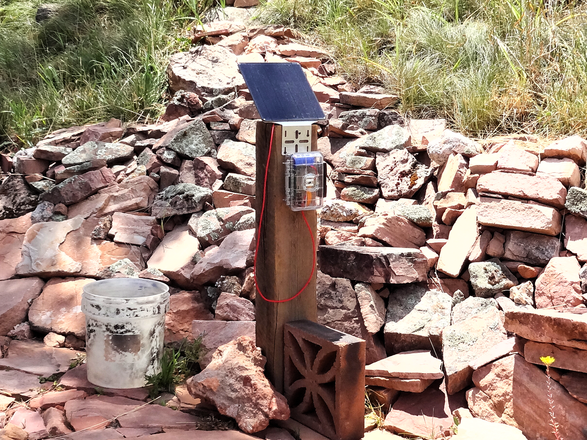

## Examples

 1. Porta-Pi - Using the Pi Platter, along with a high resolution 1024x600 pixel HDMI monitor to build a touchscreen computer with soft power off.
 2. motioneyeos - Using the Pi Platter to provide battery backup and pan/tilt functionality to the motioneyeos distribution.
 3. pi_car - The original demo created during development of the Pi Platter using it to provide power and motor control to a wifi-controlled robotic car with vision.
 4. solar_timelapse - A solar powered timelapse camera using the solar charging capability of the Pi Platter along with RTC-controlled wake-up for a raspberry pi camera.

 The ```nature_cam.sh``` script is a simple demonstration script that can be included in a camera like the solar_timelapse along with a servo to take pictures in multiple directions.
 

 




