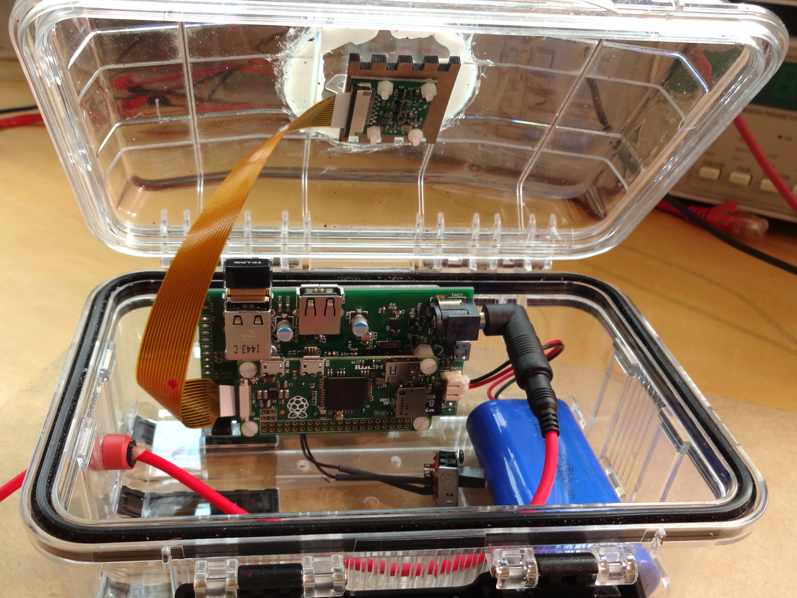
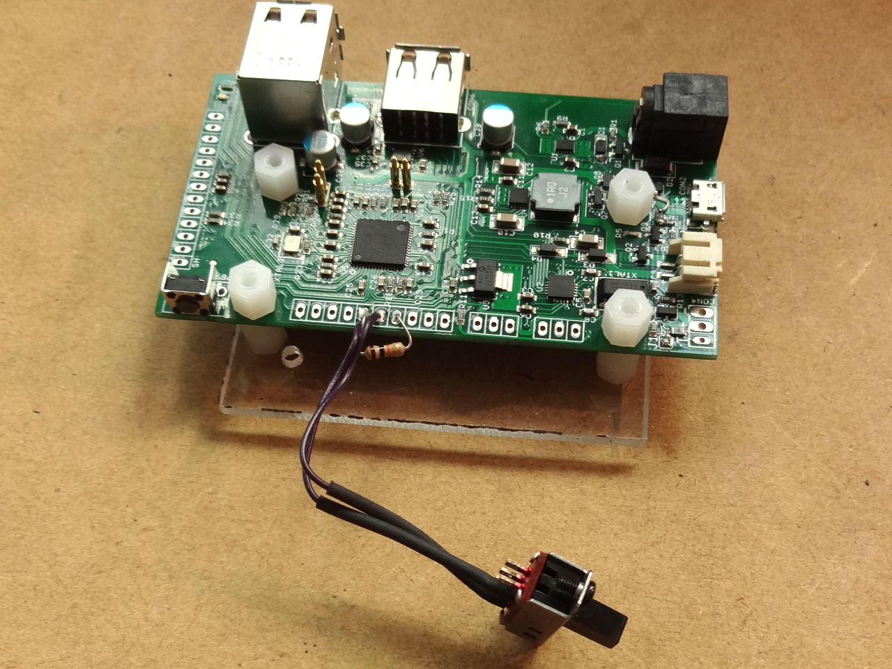

## Documentation

This directory contains the script for the solar powered time-lapse camera documented at [my website](https://www.danjuliodesigns.com/products/pi_platter_timelapse.html).

The script controls taking a picture, scheduling the next wake-up time for the system and then executing a controlled shutdown and power-down.

It also monitors a switch attached to the Solar Pi Platter A1 input to allow the user to power-up the system without the time-lapse camera functionality (for example, to off-load photos).

### Configuration

Install and configure an operating system.  I use [DietPi](http://dietpi.com).  Install any necessary additional software such as ssh and configure WiFi if desired.

Install talkpp and the powerdown script in /usr/local/bin.

Install the timelapse.sh script in /usr/local/bin.

Create the picture repository at /usr/local/pictures: sudo mkdir /usr/local/pictures.

Edit /etc/rc.local and add the lines

	# Start the photography script
	/usr/local/bin/timelapse.sh &

Set the Solar Pi Platter RTC from the Pi (after it's clock as been set) using the command

	talkpp -s

### Hardware

A switch with a 10k-ohm pull-up resistor is connected to the Pi Platter A1 input.  The pull-up is connected between A1 and 3.3V so that A1 is high when the switch is open. The switch is connected between A1 and GND so that A1 is low when the switch is closed.

Power is supplied using a 6V 9W solar panel such as this one from [voltaic](https://voltaicsystems.com/9-watt-panel/).

### Operation

Open the switch and power-up the Pi Platter.  It will take the first photograph, schedule the next photograph and then power down.

Close the switch before powering up to configure the device into offload mode.

