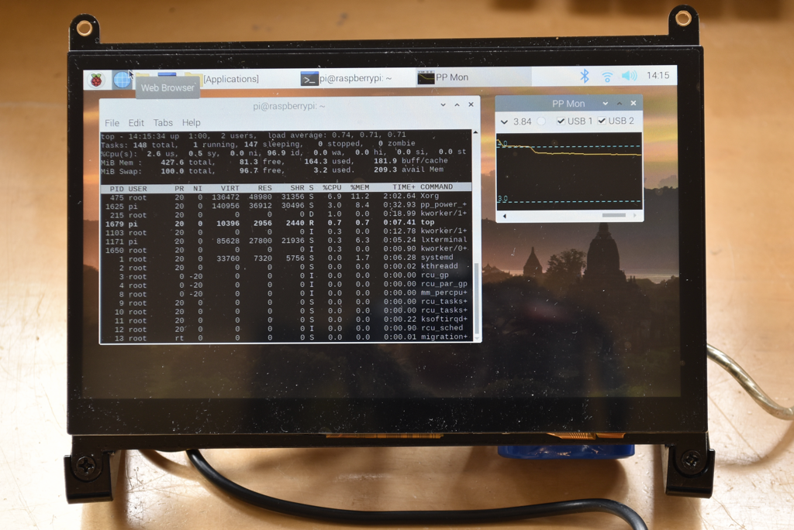
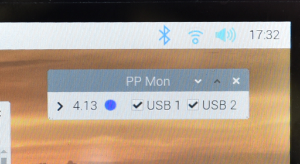
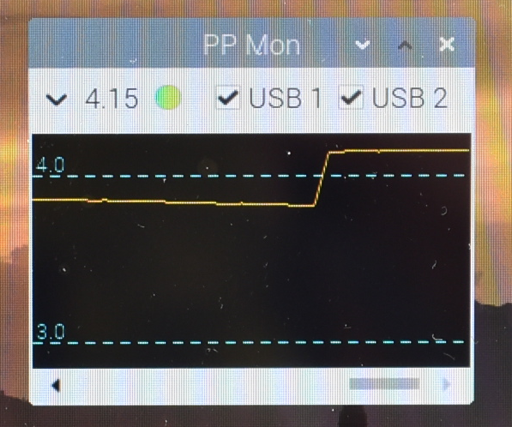

## pp\_power\_mon

This directory contains the code for the pp\_power\_mon GUI program.  This utility displays the Pi Platter battery voltage and charge status and allows control of the switchable USB port power in a little applet in a small window on the Raspberry Pi desktop.

The utility is written using the [Xojo](https://www.xojo.com) development environment and compiled for 32-bit ARM 7 linux (such as found on the Raspberry Pi Zero 2 W but not the original Raspberry Pi Zero).  It should run on other ARM 7 linux computers with hardware floating point support.  Both the Xojo source and compiled binary are found here.



### Installation
Copy the ```ppp_power_mon.zip``` file found at the following locations to your Pi.

1. In this repository in the ```xojo/Builds - pp_power_mon/Linux ARM/``` directory
2. From the download section on the Solar Pi Platter page at my [website](https://www.danjuliodesigns.com/products/solar_pi_platter.html).

Unzip in a known location such as Applications in the Pi user's home directory.

	unzip ppp_power_mon.zip
	
The executable ```ppp_power_mon```, along with supporting libraries, will be found in the unpacked directory.

	pi@raspberrypi:~/Applications $ ls pp_power_mon/
	pp_power_mon  'pp_power_mon Libs'  'pp_power_mon Resources'

Ensure the binary is executable.

	pi@raspberrypi:~/Applications $ chmod +x pp_power_mon/pp_power_mon

### Running and Operation

Execute the utility from a shell that has the desktop environment configured (e.g. a terminal window).

	pi@raspberrypi:~/Applications $ ./pp_power_mon/pp_power_mon &

The utility should start in a condensed format showing the battery voltage, charge status and USB power controls.



The status indicator to the right of the battery voltage displays the following information via its color.

- Battery Charging : Green
- Battery Low : Red
- Power from USB (not charging) : Blue
- Normal battery operation : White

Clicking the disclosure arrow to the left of the battery voltage displays the battery graph (updated every second).  The following picture shows the battery voltage after charging commenced.



The checkboxes are used to turn power on and off to the two switchable USB ports on the Solar Pi Platter.  Just be sure your mouse isn't plugged in to the port you turn off... 

### Note
This program won't run on the original Raspberry Pi Zero or Raspberry Pi Zero W because they lack the hard floating point that the Xojo binary requires.

### Questions?

Contact the author - dan@danjuliodesigns.com

