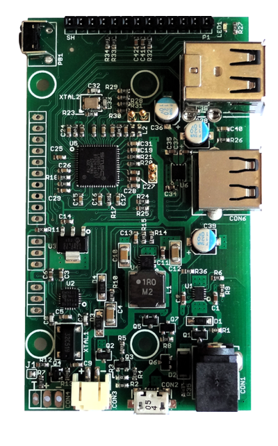

## Rocket Blue Automation

This directory contains information for Rocket Blue Automation projects.

### Solar Pi Platter

The [Solar Pi Platter](https://www.danjuliodesigns.com/products/solar_pi_platter.html) is a sophisticated expansion board for the Raspberry Pi Zero and Pi Zero 2 W single-board computers first introduced on [kickstarter](https://www.kickstarter.com/projects/1647124460/solar-pi-platter) in 2016.

The board can be purchased on [tindie] (https://www.tindie.com/products/globoy/solar-pi-platter/).

